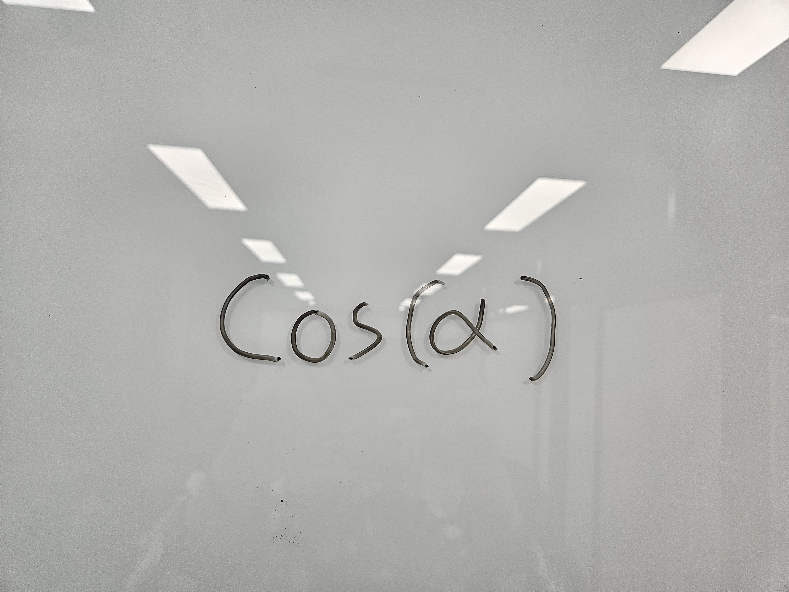
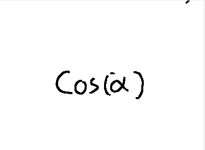
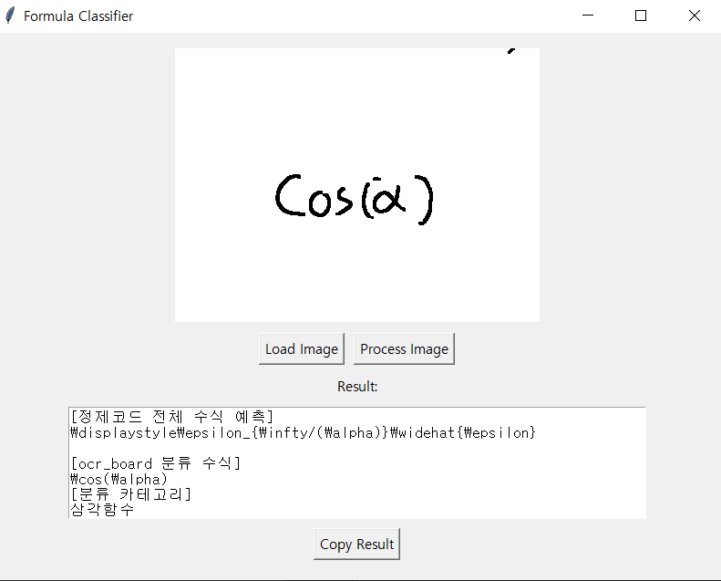

# 수식 인식 칠판 OCR 프로젝트


이 프로젝트는 "필기한 수식을 사진으로 찍어 바로 노션에 붙여넣을 수 있다면 얼마나 편할까?"  라는 생각에서 시작해서 
**손글씨 수식 이미지나 교재의 수식 스크린샷을 자동으로 인식하여 LaTeX 코드로 변환**하는 시스템을 구축하고자 시작되었습니다.  


## 개요

- **목적**: 칠판에 쓰인 수식 이미지를 자동으로 인식하고 분류
- **주요 기능**:
  - 칠판 이미지에서 수식 영역 자동 검출
  - 이미지 전처리(잡음 제거, 이진화 등)
  - 수식 분류를 위한 딥러닝 모델 적용
  - 간단한 GUI 제공
  - 노션에 결과 저장

## 초기 접근: Pix2Tex 기반 수식 생성 모델

- **사용 아키텍처**: `pix2tex` (CNN + Transformer 기반 시퀀스 생성)
- **학습 데이터**: CROHME 데이터셋 (`image`, `LaTeX label` 쌍)
- **학습 과정**:
  1. `train.pkl` 생성 (`pix2tex.dataset.dataset`)
  2. `config.yaml` 설정 후 `pix2tex.train` 실행
  3. LaTeX 시퀀스를 직접 예측하는 seq2seq 학습 진행

### 한계 및 문제점

- 특정 수식만 반복 예측되는 현상 (`\mu_{i}=d_{i}` 등)
- 긴 수식이나 복잡한 구조에서 예측 실패 빈도 증가
- attention alignment 불안정으로 인한 오예측
- 학습 안정성과 일반화 성능 모두 미흡


## 수식 분류기 모델로 전환

복잡한 시퀀스를 예측하는 대신, **수식 이미지를 사전 정의된 클래스 중 하나로 분류하는 방식**으로 전략을 전환하였습니다.

- 수식 유형을 분류하는 다중 클래스 문제로 재정의
- 기존 데이터셋과 pix2tex 기반 전처리 구조는 그대로 활용
- CNN 기반 classifier 모델을 통해 안정적 학습 및 평가 수행

### 전환으로 얻은 효과

- 빠르고 안정적인 학습 수렴
- 수식 정답과의 구조적 일치율 향상
- 다양한 수식 유형 분류 가능 (예: 방정식, 미분식, 급수식 등)


## 주요 기술 스택

- **이미지 처리**: OpenCV, scikit-image
- **딥러닝 프레임워크**: PyTorch
- **GUI**: Tkinter
- **기타 라이브러리**: NumPy, Albumentations, OpenCV-Python , Pydantic, WandB

## 설치 방법

1. 저장소 클론:
   ```bash
   git clone [저장소 URL]
   cd ocr_board
   ```

2. Python 3.11 가상 환경 생성 및 활성화:
   - Windows:
     ```bash
     # Python 3.11 가상 환경 생성
     py -3.11 -m venv venv311
     
     # 가상 환경 활성화
     .\venv311\Scripts\activate
     ```
   - macOS/Linux:
     ```bash
     # Python 3.11 가상 환경 생성
     python3.11 -m venv venv311
     
     # 가상 환경 활성화
     source venv311/bin/activate
     ```

3. 의존성 설치:
   ```bash
   pip install -r requirements.txt
   ```

4. (선택사항) 가상 환경 비활성화:
   ```bash
   deactivate
   ```

## 노션(Notion) 연동 설정(이 내용 검증 좀)

1. **노션 API 토큰 발급**:
   - [Notion Developers](https://www.notion.so/my-integrations) 사이트에서 새 integration을 생성합니다.
   - 생성된 "Internal Integration Token"을 복사합니다.

2. **노션 페이지 공유**:
   - 결과를 저장할 Notion 페이지를 엽니다.
  - 우측 상단 `...` 메뉴 > `Add Connections` 선택 > 앞서 만든 Integration을 연결합니다.
  - 연결 후 URL에서 **페이지 ID**를 추출합니다:
  - 예: `https://www.notion.so/yourworkspace/abc1234567890abcdef1234567890abcd`
  - 페이지 ID = `abc1234567890abcdef1234567890abcd` (하이픈 제거)

3. **환경 변수 설정**:
   [image_gui.py](cci:7://file:///c:/Users/jwlv1/OneDrive/%EB%B0%94%ED%83%95%20%ED%99%94%EB%A9%B4/ocr_board/image_gui.py:0:0-0:0) 파일을 열고 다음 부분을 수정하세요:
   ```python
   # Notion 정보
   NOTION_TOKEN = "여기에_발급받은_토큰_입력"  # 시크릿 노션 토큰 기입 (필수)
   NOTION_PAGE_ID = "여기에_페이지_ID_입력"    # 노션 사이트 ID 기입 (필수)

   #사용을 원치 않을시에는 164번째 줄을 주석처리하면 노션기능 없이 사용가능합니다

## 사용 방법

1. 애플리케이션 실행:
   ```bash
   python main.py
   ```

2. GUI가 실행되면 다음 단계를 따르세요:
   - `Alt+S`를 눌러 스크린샷 촬영 혹은 `Load Image` 버튼을 눌러 이미지 파일을 직접 선택
   - `Process Image` 버튼을 눌러 이미지 처리 및 수식 인식
   - `Copy Result` 버튼을 눌러 결과를 클립보드에 복사

3. 학습데이터량이 적기 때문에 demo_photos나 test에 있는 사진으로 실행하시면 더 명확한 결과를 확인해 보실 수 있습니다.

## 프로젝트 구조

```
ocr_board/
├── CROHME/               # 학습 데이터 및 모델 관련 파일
├── demo_photos/          # 데모용 수식 이미지
├── __pycache__/
├── image_convert.py      # 이미지 변환 유틸리티
├── image_gui.py          # 그래픽 사용자 인터페이스
├── image_process.py      # 이미지 전처리 함수들
├── main.py               # 메인 애플리케이션 진입점
└── requirements.txt      # 의존성 목록
```

## 주요 기능 상세

### 이미지 전처리
- 그레이스케일 변환
- 양방향 필터링을 통한 잡음 제거
- CLAHE(Contrast Limited Adaptive Histogram Equalization) 적용
- 이진화 및 모폴로지 연산
- 스켈레토나이제이션(뼈대화)

### 수식 인식 모델

- **학습 데이터**:
  - 공개 데이터셋인 **CROHME** 수식 이미지
  - 직접 작성한 **손글씨 수식 이미지**
  - 전처리가 필요한 **저해상도/왜곡된 수식 이미지**를 포함하여 **데이터 증강 학습 수행**

- **모델 구조**:
  - PyTorch 기반 **CNN 아키텍처**
  - 수식을 직접 생성하는 것이 아닌, **사전 정의된 수식 유형(Class)으로 분류**
  - 학습 시 Albumentations 기반의 증강 처리 및 noise 대응 학습 병행

- **학습 방식**:
  - 이미지 전처리 → 특징 추출 → 수식 유형 분류
  - 인식된 수식 결과는 LaTeX 코드 또는 사전 등록된 수식 표현으로 출력


## 🧪 실행 예시

### 1️⃣ 입력 이미지


### 2️⃣ 전처리 결과
- Grayscale 변환
- Adaptive Threshold 적용
- Morphology 연산


### 3️⃣ 예측 결과

```latex
[ocr_board 분류 수식]
\cos(\alpha)
[분류 카테고리]
삼각함수
```


### 현재 한계점

1. **학습 데이터셋의 양과 다양성 부족**
   - CROHME 외에 수집한 손글씨 이미지 수가 제한적이며,
   - 필기체 스타일의 다양성이 부족해 실제 사용자의 손글씨를 일반화하기 어려움

2. **분류 방식의 표현력 한계**
   - 분류 모델은 사전 정의된 수식 class만 예측할 수 있어
   - 새로운 형태나 구조의 수식을 다루기 어려움

3. **분류 체계의 제한**
   - 분류 기준이 수식의 구조/의미/형식 중 하나로만 고정되어 있음
   - 다의적 수식이나 유사 표현에 대해 유연하지 못함

### 🔧 향후 개선 방향

- **더 다양한 필기체 스타일과 실제 사용자 손글씨**를 포함한 데이터셋 확보할 예정
- 분류 class를 **형태 기반 + 의미 기반**으로 이원화하거나 계층화된 분류 체계 도입
- 장기적으로는 분류 기반 + 시퀀스 생성 기반을 **하이브리드로 결합한 인식기**로 발전시킬 계획


## 참여자

- [심종우](https://github.com/leaf1191)
- [김지민](https://github.com/링크)


